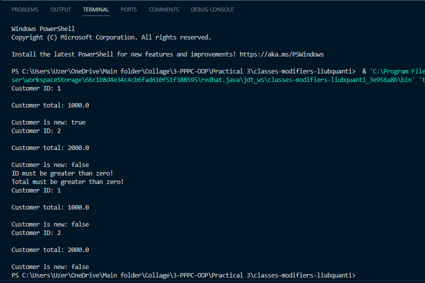

# Класи та модифікатори видимості - ПР

Код класу `Customer.java`:

```java
package domain;

public class Customer {

    private int ID;
    private double total;
    private boolean isNew;

    public Customer() {

        this(1, 1000, true);

    }

    public Customer(int ID, double total, boolean isNew) {

        this.ID = ID;
        this.total = total;
        this.isNew = isNew;

    }

    public void displayCustomerInfo() {

        System.out.println("Customer ID: " + this.ID);
        System.out.println("\nCustomer total: " + this.total);
        System.out.println("\nCustomer is new: " + this.isNew);

    }

    public int getID() {

        return this.ID;

    }

    public double getTotal() {

        return this.total;

    }

    public boolean isNew() {

        return this.isNew;

    }

    public void setID(int ID) {

        if (ID > 0) {

            this.ID = ID;

        } else {

            System.out.println("ID must be greater than zero!");

        }

    }

    public void setTotal(double total) {

        if (total > 0) {

            this.total = total;

        } else {

            System.out.println("Total must be greater than zero!");

        }

    }

    public void setIsNew(boolean isNew) {

        if (isNew == false && this.isNew == true) {

            this.isNew = isNew;

        } else {

            System.out.println("Customer is not new!");

        }

    }

}
```

Скриншот роботи програми:


