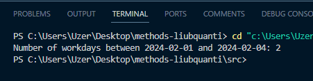

# Практична робота "Створення і використання статичних методів"

## Завдання

Знайти кількість робочих днів (субота і неділя - вихідні) у проміжку між двома заданими датами.

## Код файлу Exercise.java

```java
import java.time.DayOfWeek;
import java.time.LocalDate;

public class Exercise {
    private static int countWeekdays(LocalDate start, LocalDate end) {
        int weekdays = 0;
        LocalDate date = start;
        while (!date.isAfter(end)) {
            if (date.getDayOfWeek() != DayOfWeek.SATURDAY && date.getDayOfWeek() != DayOfWeek.SUNDAY) {
                weekdays++;
            }
            date = date.plusDays(1);
        }
        return weekdays;
    }

    public static int Calculate(LocalDate startDate, LocalDate endDate) {
        if (startDate == null || endDate == null || startDate.isAfter(endDate)) {
            return 0;
        }
        return countWeekdays(startDate, endDate);
    }
}

```

## Код файлу TestResult.java

```java
import java.time.LocalDate;

public class TestResult {
    public static void main(String[] args) {
        LocalDate startDate = LocalDate.of(2024, 2, 1);
        LocalDate endDate = LocalDate.of(2024, 2, 4);
        int workdays = Exercise.Calculate(startDate, endDate);
        System.out.println("Number of workdays between " + startDate + " and " + endDate + ": " + workdays);
    }
}

```

## Фото роботи програми


