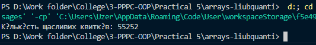

# Виконане завдання

### Обране завдання

- Трамвайні квитки мають шестизначні номери, вважають якщо квиток «щасливий» то сума перших трьох цифр дорівнює сумі останніх. Знайти кількість щасливих квитків.

### Код файлу Exercise.java

```java
package domain;

/**
 * Клас Exercise містить метод для обчислення кількості "щасливих" трамвайних квитків.
 */
public class Exercise {

    /**
     * Метод обчислює кількість "щасливих" трамвайних квитків.
     * @return кількість щасливих квитків
     */
    public static int Calculate() {
        int count = 0;
    
        // Перебираємо всі можливі шестизначні номери
        for (int i = 0; i <= 999999; i++) {
            int firstPart = i / 1000;
            int secondPart = i % 1000;
        
            if (sumOfDigits(firstPart) == sumOfDigits(secondPart)) {
                count++;
            }
        }
    
        return count;
    }
  
    /**
     * Метод для обчислення суми цифр числа.
     * @param number число, сума цифр якого обчислюється
     * @return сума цифр числа
     */
    private static int sumOfDigits(int number) {
        int sum = 0;
        while (number > 0) {
            sum += number % 10;
            number /= 10;
        }
        return sum;
    }
}

```

### Код файлу TestResult.java

```java
package test;

import domain.Exercise;

/**
 * Клас TestResult демонструє результат виконання методу Calculate.
 */
public class TestResult {
    public static void main(String[] args) {
        int luckyTicketsCount = Exercise.Calculate();
        System.out.println("Кількість щасливих квитків: " + luckyTicketsCount);
    }
}

```

### Фото роботи програми


